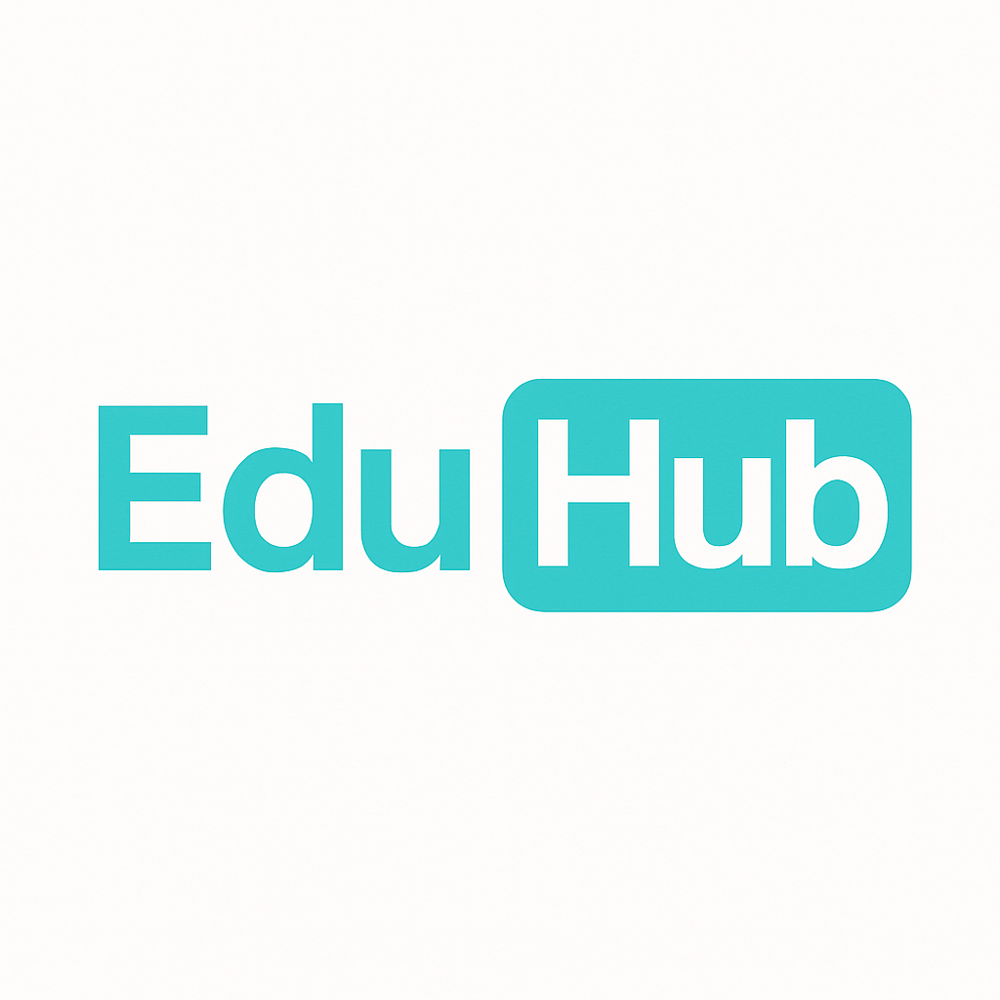

# EduHub LMS



A modern, scalable and feature-rich Learning Management System (LMS) designed to unify digital education experiences for students, instructors, and administrators. EduHub streamlines course delivery, management, and analytics with a beautiful UI and powerful backend.

---

## 🚀 Project Vision

EduHub aims to be the go-to platform for digital learning, supporting interactive courses, smart content delivery, AI-powered recommendations, and secure payments—built for scalability and extensibility.

---

## 🗂️ Project Structure

```
eduhub-lms/
├── client/                 # Frontend (Next.js)
│   ├── public/
│   └── src/
│       ├── components/
│       ├── pages/
│       └── styles/
├── server/                 # Backend (Node.js + Express)
│   ├── controllers/
│   ├── routes/
│   ├── models/
│   └── utils/
├── .env.local              # Local environment variables
├── README.md
├── package.json
└── eduhub-logo.png         # Logo used in README/UI
```

---

## 🌟 Core Features

- **Authentication**: JWT-based login/signup, role-based access (student, instructor, admin)
- **User Management**: Profile pages, dashboards, admin user control
- **Course Management**: CRUD for courses, enrollment, instructor & student dashboards
- **Content Delivery**: Video embedding (YouTube, edX, Coursera, etc.), module/playlist support
- **Assignment & Quizzes**: Instructor-created quizzes, student submissions, auto-grading (MVP)
- **Smart Dashboards**: Progress tracking, personalized recommendations (AI-powered, planned)
- **Gamification**: Badges, XP, leaderboards (planned)
- **Payment Integration**: Stripe/Razorpay for premium courses (planned)
- **Analytics**: Platform usage, engagement heatmaps (planned)
- **Admin Panel**: User & course moderation, reports (planned)

---

## 🏗️ Development Roadmap

_Phases:_

1. **Core MVP**: Auth, course CRUD, dashboard UI, REST APIs
2. **Smart Learning**: Video content, assignments/quizzes, progress tracking
3. **AI Personalization**: Recommendations, learning paths
4. **Monetization & Security**: Payments, content protection, advanced auth (OAuth/2FA)
5. **Analytics & Admin**: Admin panel, metrics dashboards
6. **Deployment & Scaling**: CI/CD, Vercel/Netlify (frontend), Render/Heroku/Railway (backend), MongoDB Atlas
7. **Community & Open Source**: Docs, issue templates, contribution guides

See [Project Phases](#project-phases) below for details.

---

## 🛠️ Getting Started

### 1. Clone the Repository

```bash
git clone https://github.com/Iitian-om/eduhub-lms.git
cd eduhub-lms
```

### 2. Install Dependencies

#### Frontend

```bash
cd client
npm install
```

#### Backend

```bash
cd ../server
npm install
```

### 3. Environment Setup

Create `.env.local` in both `client/` and `server/`:

#### `/server/.env.local`
```
MONGODB_URI=mongodb+srv://<your-cluster-url>
JWT_SECRET=your_secret_key
PORT=5000
```

#### `/client/.env.local`
```
NEXT_PUBLIC_API_URL=http://localhost:5000/api
```

> _Ensure MongoDB is running locally or use MongoDB Atlas._

---

### 4. Run the App

**Backend**  
```bash
cd server
npm run dev
```

**Frontend**  
_Open a new terminal:_
```bash
cd client
npm run dev
```

Open [http://localhost:3000](http://localhost:3000) in your browser.

---

## 🧪 Seeding & Testing

- _You may create a `seed.js` file in `server/scripts/` to pre-populate users, courses, etc._
- Use Postman or Thunder Client to test API endpoints.

---

## 🌐 Deployment

- **Frontend**: [Vercel](https://vercel.com/), [Netlify](https://www.netlify.com/)
- **Backend**: [Render](https://render.com/), [Railway](https://railway.app/), [Heroku](https://heroku.com/)
- **Database**: [MongoDB Atlas](https://www.mongodb.com/atlas)

Use separate `.env.production` files and configure CORS and secure tokens for production.

---

## 🎨 Design

- **Primary Color**: Aqua Blue `#2AC9C7`
- **UI Kit**: Tailwind CSS, fully responsive and accessible
- **Logo**: See `eduhub-logo.png` in root

---

## 👥 Contributing

1. Fork this repository
2. Create your feature branch: `git checkout -b your-feature`
3. Commit your changes: `git commit -m 'Add feature'`
4. Push to the branch: `git push origin your-feature`
5. Open a Pull Request

Please see [CONTRIBUTING.md](CONTRIBUTING.md) for code standards and process.

---

## 📄 License

This project is [MIT Licensed](LICENSE).

---

## 📞 Contact

- **Om Kumar** (maintainer): omkumar@iitp.ac.in

---

## 📅 Project Phases

See the attached [project plan](#) for a detailed breakdown, or refer to the summary below:

```
🔰 Phase 1: Core Foundation (MVP)
🎯 Phase 2: Smart Learning Features
🧠 Phase 3: Intelligent Personalization
💳 Phase 4: Monetization & Security
📊 Phase 5: Admin & Analytics
☁️ Phase 6: Deployment & Scalability
📦 Bonus: Community & Open Source
```

---

## 🤝 Acknowledgements

Thanks to the open-source community and all contributors!  
Inspired by leading LMS platforms—built with ❤️ for the EduHub community.

---

> _Let us know if you need sample .env files, scripts, or deployment guides!_